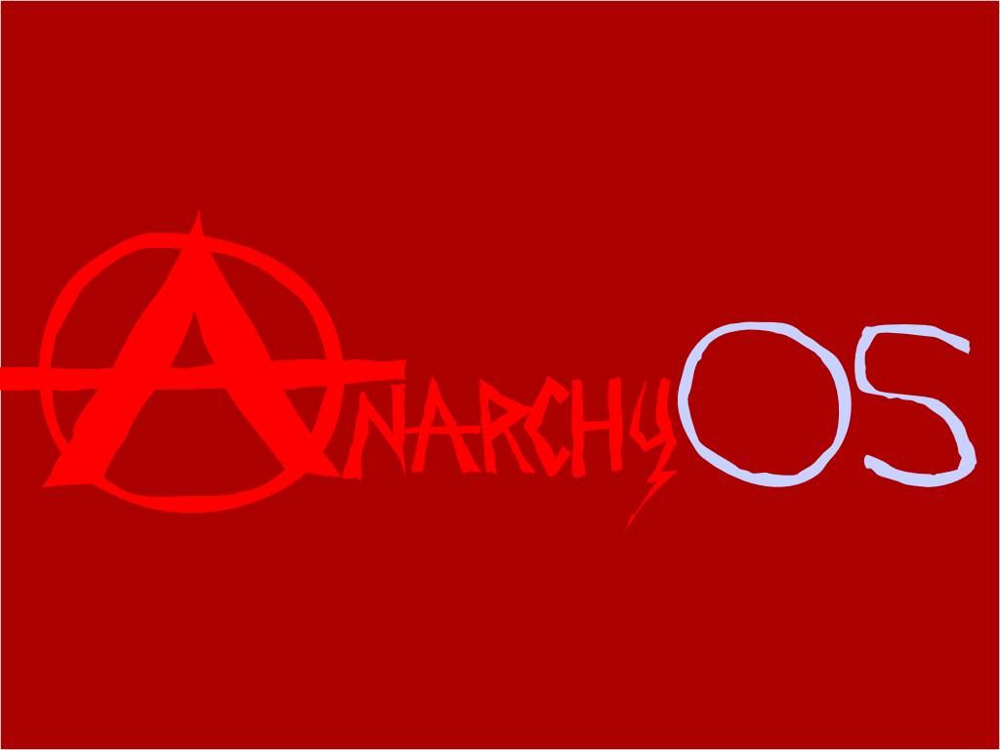

# AnarchyOS


intial artwork from [substack](https://github.com/substack).

## what

> [14:44:08] <@werle>	 what are you guys building?

> [14:46:51] <@juliangruber>	 werle: an operating system based on a npm-like package manager

> [14:47:15] <@juliangruber>	 where everyone can publish modules, semvers all the way, no dependency hell

> [14:47:24] <@juliangruber>	 modules == libraries or applications

## where

* [Wiki](https://github.com/juliangruber/anarchyos/wiki)
* [Discussions](https://github.com/juliangruber/anarchyos/issues)
* Chat: #anarchyos on freenode

## Resources

* [Modules: Providing a Flexible
User Environment](http://modules.sourceforge.net/docs/Modules-Paper.pdf)

## VM

Development takes place inside a [vagrant](http://www.vagrantup.com) vm.

To set up:

```bash
$ make init
$ make setup
$ make ssh
```

The password is `vagrant`.

## License

MIT
